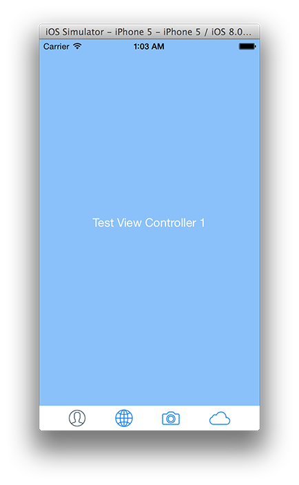
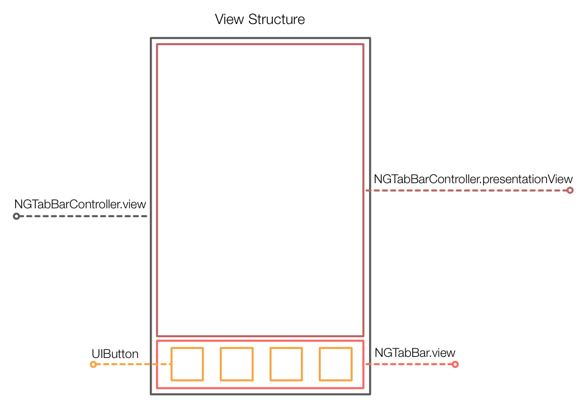

#GGTabBar

GGTabBar is a *simple* UITabBar & UITabBarController replacement that uses Auto Layout
for constructing the GUI. I created it for curiosity, but it may be useful
to others who adventure into the land of Auto Layout.



:warning: This is a work in progress/proof of concept, I'm no expert. Sorry if it's missing some feature you need, feel free to fork, pull request or open issues. I'm available on [Twitter](http://twitter.com/ngoles) if you have further questions :grimacing::ok_hand:

### Limitations :bomb:

* Still need to add customization options (background color`, `tint`, `style`, `background image`, etc.).
* The tab bar items are UIButtons (no `TabBarItem` abstraction in a `UIView`).
* Haven't tested rotation support. (should work?)
* No Pod (Cocoapods) yet.
* No `more` tab if you add more than 5 View Controllers.
* Still need to add *more* integration tests.

## Install

Just copy the `GGTabBar` folder into your Xcode project.

## Usage :rocket:

:warning: Your `UIViewControllers` must set their `tabBarItem` images (selected/normal).

### Objective-C

#### Init and customize

``` objective-c
GGTabBarController *tabBar = [[GGTabBarController alloc] init];
tabBar.tabBarAppearanceSettings = @[kTabBarAppearanceHeight : @(100.0)]; // in points
tabBar.viewControllers = @[vc1, vc2, vc3, vc4];
self.window.rootViewController = tabBar;
```

### Swift

:warning: remember to add `GGTabBar.h` into your project's Swift Bridging Header.

``` swift
var tabBar: GGTabBarController = GGTabBarController()
tabBar.tabBarAppearanceSettings = [kTabBarAppearanceHeight : 100.0];
tabBar.viewControllers = [vc1, vc2, vc3, vc4]
self.window!.rootViewController = tabBar
```

:warning: Feel free to explore the provided `Example Project` to check out how to use `GGTabBar`.

## Structure :wine_glass:

All the views are setup with Auto Layout. There are no CGRect, Struts or Sprints, so unless you break the constraints, everything should work on different screen-sizes.

If you want more information about how the `AutoLayout Constraints` are specified, please take a look at the tests. It's the best way to understand what's going on here.



## Debug :bug:

Normally you won't be doing any sort of Debug, but it something strange happens
you can enable debugMode so that all the UIView's backgrounds are painted.

To enable debug mode:

*Objective-C*

``` objective-c
tabBar.debug = YES;
```

*Swift*

``` objective-c
tabBar.debug = true
```

* Green Views: Margins, there are always exactly two of them.
* Red Views: Separators, located between buttons.
* Blue View: The GGTabBar.view.
* White Views: Button backgrounds.

## Emoji :shit:

You got to freakin' :heart: them :grin:! 
